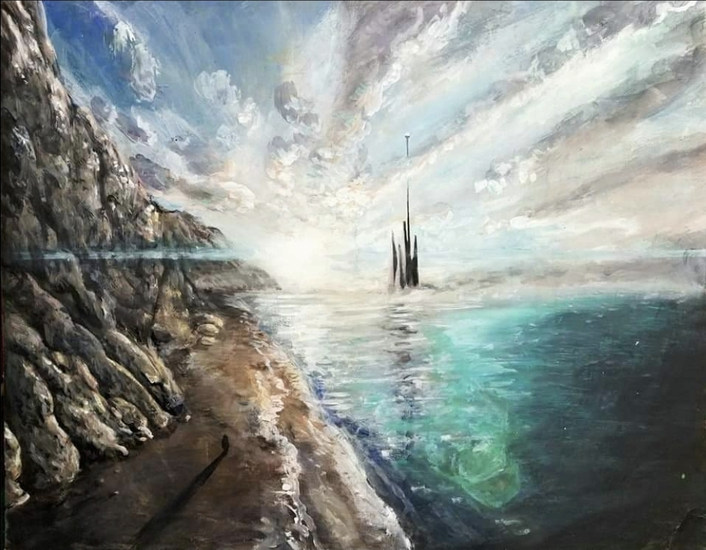

# Living Paintings

A motion sequence generated from original static paintings.
Each scene originates from a physical artwork created with internal rules for light, motion, and structure.
The animation does not add motion so much as reveal motion already implied in the composition.

> 
> A view over the ocean and cliffs toward a geometric crystal city. Gradients simulate ray tracing, and lens flare acts as a conceptual filter, enhancing the scene's imagined depth. 

## Explanatory Essay

Paintings as Sheaves:
https://standardgalactic.github.io/video-player/Paintings%20as%20Sheaves.pdf

---

## Watch

Full sequence:
https://standardgalactic.github.io/video-player/

---

## Scene Descriptions

1. Aerial Coastline & Crystal City

View over ocean and cliffs toward a geometric crystal city reflecting light. The lighting gradient and reflections are painted with consistent directionality that later supports animated highlights and bloom.

2. Jungle Undergrowth & Small Dinosaurs

Layered foliage with small dinosaurs moving through it. Depth is encoded by overlap and occlusion, allowing motion to resolve into traversal paths rather than displacement.

3. Maiasaurs with Their Nest

Larger dinosaurs arranged around eggs. Poses encode balance and orientation but not strong forward motion, producing a low-movement dynamic when animated.

4. White Horse in Blue Motion

A horse depicted mid-stride with directional smear and asymmetric limb positioning. The painting encodes a single dominant motion vector, reducing ambiguity during animation.

5. Alien Rock Structures on a Lavender World

Vertical structures and color gradients imply scale and atmosphere but minimal subject motion. Animation primarily extends camera movement through fixed spatial geometry.

6. Cliffside Dragon

The pose encodes hinge points and counter-torque (wings, limb bracing, neck rotation). These function as constraints that produce stable rotational motion rather than arbitrary deformation.

---

## Notes on Animation

Each shot comes from one painting, not composites or generated scenes.

Motion emerges from built-in cues: anatomy, light behavior, articulation, symmetry breaking, and occlusion ordering.

Ambiguities in structure become degrees of freedom in motion rather than failures.

---

## Mathematical Background

1. Paintings as Constraint Sheaves

Let <code>X</code> be the 2-D canvas space.
For every sub-region <code>U ⊆ X</code>, let <code>F(U)</code> be the set of valid physical interpretations (lighting, pose, depth, motion hints).

The mapping:

U → F(U)

acts like a sheaf if:

1. Local agreement: interpretations match on overlap:

F(U1 ∩ U2) from U1  ==  F(U1 ∩ U2) from U2

2. Gluing: overlapping interpretations can merge into one global one.

A painting is:

Condition	Meaning

F(X) ≠ ∅	At least one consistent physical interpretation exists
`	F(X)
`	F(X)
F(X) = ∅	No coherent interpretation (contradiction in structure)

Directional ambiguity (e.g., unsure which way a dinosaur walks) corresponds to:

|F(X)| > 1

---

2. Animation as Global Section Selection

Animation proceeds by:

1. Choosing a global interpretation:

s ∈ F(X)

2. Extending it through time using a motion operator:

T : F(X) → Dyn

Animation therefore continues existing constraints rather than inventing new ones.

---

3. Built-In Optics as Restriction Maps

Lighting behavior is carried by constraint propagation rules:

ρ(V → U) : F(V) → F(U),  for U ⊆ V

These act like optical components baked into paint:

Painted Feature	Acts like

Specular smear	Reflection kernel
Bloom gradient	Light falloff curve
Fading distance tones	Atmospheric scattering
Highlight shape	Aperture response

---

4. Reducing Ambiguity While Painting

Painterly decisions shrink the space of global interpretations:

Painting cue	Resolves ambiguity in

Clear head/body axis	Facing direction
Uneven stride	Gait phase
Mass imbalance (tail vs chest)	Center of gravity
Eye-direction	Viewing vector

Formally, these choices shrink the allowed interpretations:

F_new ⊆ F
|F_new(X)| ≤ |F(X)|

---

5. Summary

Symbol	Meaning

F	Physical interpretations implied by paint
s ∈ F(X)	One coherent world interpretation
T	Animation extending that world in time
`	F(X)
ρ	Constraint passing between regions

---

Claim

> Animation does not invent motion — it unfolds constraints already encoded in the painting.
The artwork behaves like a partially-specified physics model, not a flat image.
